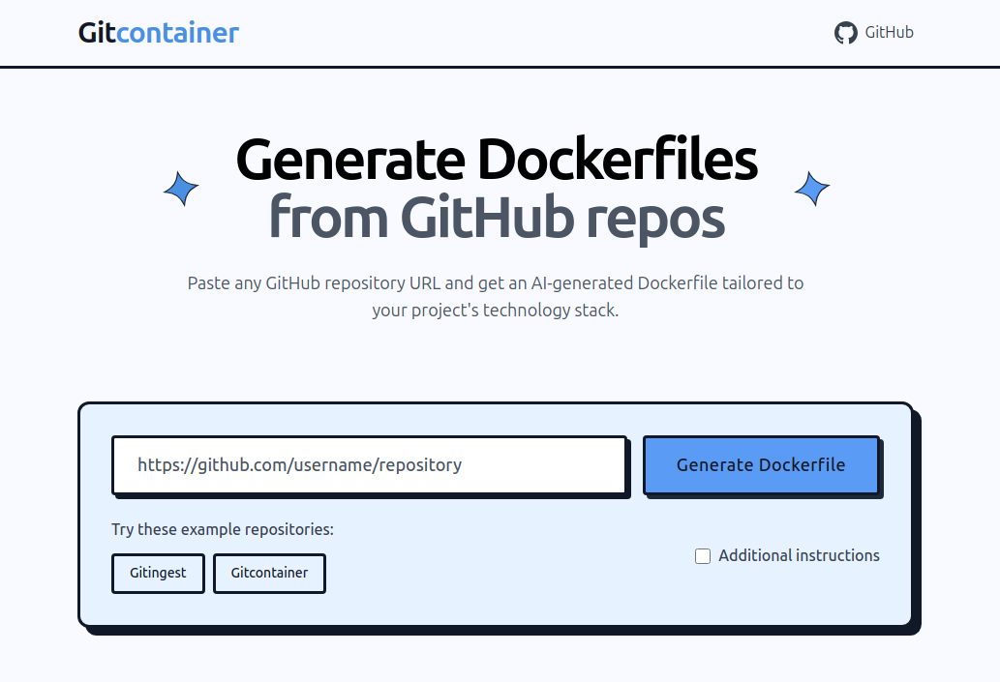

# Gitcontainer 🐳

**Turn any GitHub repository into a production-ready Docker container with AI-powered Dockerfile generation.**

[](https://choosealicense.com/licenses/mit/)
[](https://www.python.org/downloads/)
[](https://fastapi.tiangolo.com/)

Gitcontainer is an AI-powered web application that automatically generates production-ready Dockerfiles by analyzing GitHub repositories. Simply paste a GitHub URL and get a tailored Dockerfile with intelligent base image selection, dependency management, and Docker best practices.

## ✨ Features

- **🤖 AI-Powered Analysis**: Uses OpenAI GPT-4 to analyze repository structure and generate intelligent Dockerfiles
- **⚡ Real-time Streaming**: Watch the AI generate your Dockerfile in real-time with WebSocket streaming
- **🎯 Smart Detection**: Automatically detects technology stacks (Python, Node.js, Java, Go, etc.)
- **🔧 Production-Ready**: Generates Dockerfiles following best practices with proper security, multi-stage builds, and optimization
- **📋 Additional Instructions**: Add custom requirements for specialized environments
- **📄 Docker Compose**: Automatically suggests docker-compose.yml for complex applications
- **🎨 Modern UI**: Clean, responsive interface with Monaco editor for syntax highlighting
- **📱 Mobile Friendly**: Works seamlessly on desktop and mobile devices

## 🚀 Quick Start

### Prerequisites

- Python 3.9 or higher
- Git
- OpenAI API key

### Installation

1. **Clone the repository:**
   ```bash
   git clone https://github.com/cyclotruc/gitcontainer.git
   cd gitcontainer
   ```

2. **Install dependencies:**
   ```bash
   pip install -r requirements.txt
   ```

3. **Set up environment variables:**
   ```bash
   # Create .env file
   echo "OPENAI_API_KEY=your_openai_api_key_here" > .env
   ```

4. **Run the application:**
   ```bash
   python app.py
   ```

5. **Open your browser:**
   Navigate to `http://localhost:8000`

## 🛠️ How It Works

1. **Repository Cloning**: Gitcontainer clones the GitHub repository locally using Git
2. **Code Analysis**: Uses [gitingest](https://github.com/cyclotruc/gitingest) to analyze the repository structure and extract relevant information
3. **AI Generation**: Sends the analysis to OpenAI GPT-4 with specialized prompts for Dockerfile generation
4. **Smart Optimization**: The AI considers:
   - Technology stack detection
   - Dependency management
   - Security best practices
   - Multi-stage builds when beneficial
   - Port configuration
   - Environment variables
   - Health checks

## 📁 Project Structure

```
cyclotruc-gitcontainer/
├── app.py                 # Main FastAPI application
├── requirements.txt       # Python dependencies
├── .env                  # Environment variables (create this)
├── static/               # Static assets (icons, CSS)
├── templates/
│   └── index.jinja       # Main HTML template
└── tools/                # Core functionality modules
    ├── __init__.py
    ├── create_container.py  # AI Dockerfile generation
    ├── git_operations.py    # GitHub repository cloning
    └── gitingest.py        # Repository analysis
```

## 🔧 Configuration

### Environment Variables

| Variable | Description | Required |
|----------|-------------|----------|
| `OPENAI_API_KEY` | Your OpenAI API key | Yes |
| `PORT` | Server port (default: 8000) | No |
| `HOST` | Server host (default: 0.0.0.0) | No |

### Advanced Usage

You can use the tools programmatically:

```python
from tools import clone_repo_tool, gitingest_tool, create_container_tool
import asyncio

async def generate_dockerfile(github_url):
    # Clone repository
    clone_result = await clone_repo_tool(github_url)
    
    # Analyze with gitingest
    analysis = await gitingest_tool(clone_result['local_path'])
    
    # Generate Dockerfile
    dockerfile = await create_container_tool(
        gitingest_summary=analysis['summary'],
        gitingest_tree=analysis['tree'],
        gitingest_content=analysis['content']
    )
    
    return dockerfile

# Usage
result = asyncio.run(generate_dockerfile("https://github.com/user/repo"))
print(result['dockerfile'])
```

## 🎨 Customization

### Adding Custom Instructions

Use the "Additional instructions" feature to customize generation:

- `"Use Alpine Linux for smaller image size"`
- `"Include Redis and PostgreSQL"`
- `"Optimize for production deployment"`
- `"Add development tools for debugging"`

## 📝 License

This project is licensed under the MIT License - see the [LICENSE](LICENSE) file for details.

## 🙏 Acknowledgments

- **[OpenAI](https://openai.com/)** for providing the GPT-4 API
- **[gitingest](https://github.com/cyclotruc/gitingest)** for repository analysis capabilities
- **[FastAPI](https://fastapi.tiangolo.com/)** for the excellent web framework
- **[Monaco Editor](https://microsoft.github.io/monaco-editor/)** for code syntax highlighting

## 🔗 Links

- **GitHub Repository**: [https://github.com/cyclotruc/gitcontainer](https://github.com/cyclotruc/gitcontainer)
- **Demo**: Try it live with example repositories
- **Issues**: [Report bugs or request features](https://github.com/cyclotruc/gitcontainer/issues)

---

**Made with ❤️ by [Romain Courtois](https://github.com/cyclotruc)**

*Turn any repository into a container in seconds!*